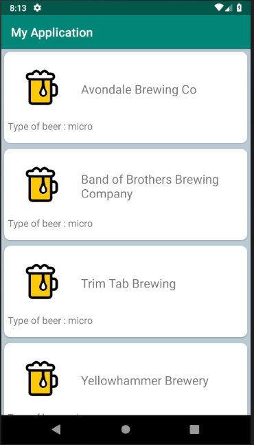
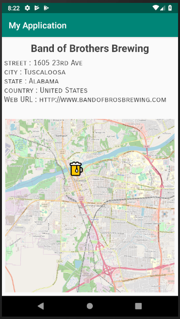

# MyApplication

* Première application mobile développée sur Android Studio par [PichCa](https://github.com/PichCa) 3A CFA de l'ESIEA en travaux pratiques de programmation mobile encadrés par [M.ETIENNE](https://github.com/Vincebrees) de Février à Mai 2019.

---

## Présentation :

* Cette application affiche des brasseries des Etats-Unis vendant différents types de bières et utilise l'[API](https://api.openbrewerydb.org/breweries). En cliquant sur une des brasseries on obtient sa géolocalisation, son adresse et url de la brasserie. 

---

## Prérequis :
1. Intallation d'Android Studio 
2. Récupération de la [branche image](https://github.com/PichCa/MyApplication/tree/feature/img)

---

## Consignes : 
* Deux écrans : Un écran avec une liste et un écran avec un détail de l’item.
* Appel WebService à une API Rest.
* Stockage des données en cache.

---

## Fonctionnalités : 
1. Ecran home : 
* Affiche la liste des brasseries des Etats-Unis
* Description des bières vendues.
:
2. Ecran du détail de la localisation des brasseries : 
* Rappelle le nom de la brasserie
* Affiche l’adresse de la brasserie
* L’url du site de la brasserie 
* La localisation de la brasserie avec l’icône bière
:

---

## Amélioration possible : 
* Stocker les données de l'API en cache
* Envoie des notifications push
* Sur la carte du deuxième écran actualiser la position du pin après zoom
* Améliorer le design 
* Améliorer l'architecture 
* Améliorer le GitFlow 
